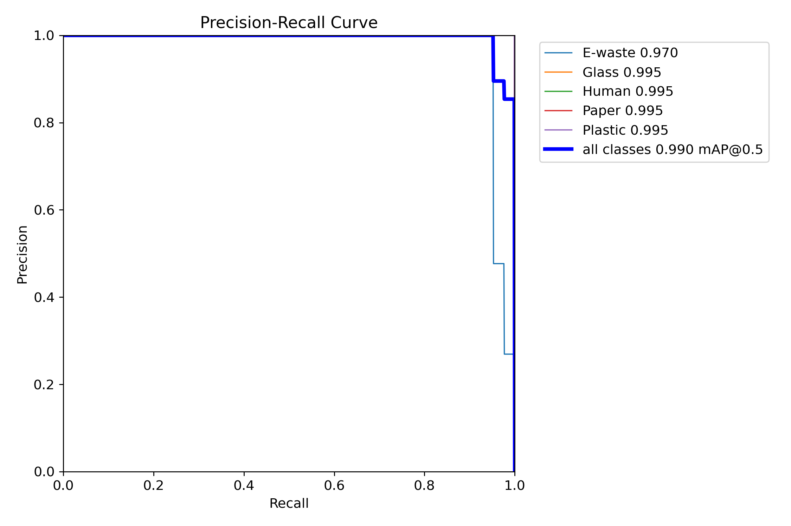
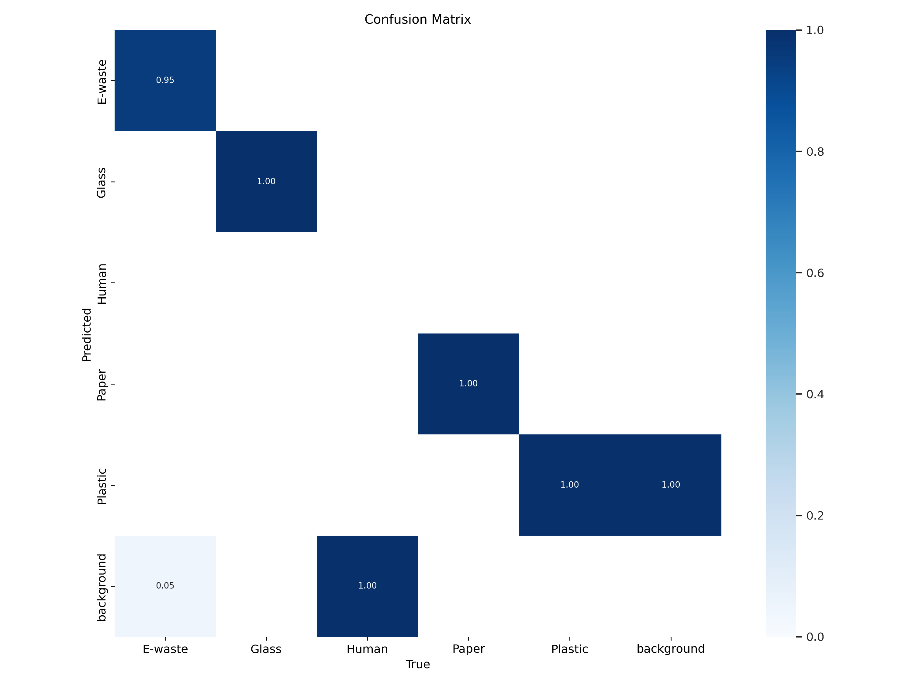

# Smart Waste Sorter - Waste Detection

This project, **Smart Waste Sorter**, uses computer vision to identify and sort waste into different categories, improving waste management. The app is powered by a custom-trained YOLOv5 model to detect various waste items such as plastic, paper, glass, and e-waste.

## Table of Contents

1. [Introduction](#introduction)
2. [Features](#features)
3. [Technology Stack](#technology-stack)
4. [Installation](#installation)
5. [Usage](#usage)
6. [Model Training](#model-training)
    - [Dataset](#dataset)
    - [Preprocessing](#preprocessing)
    - [Model Architecture](#model-architecture)
    - [Training Process](#training-process)
    - [Model Evaluation](#model-evaluation)
       - [Precision-Recall (PR) Curve](#precision-recall-pr-curve)
       - [Confusion Matrix](#confusion-matrix)
7. [Contributing](#contributing)
8. [License](#license)

---

## Introduction

The **Smart Waste Sorter** aims to streamline the waste management process by using image recognition to automatically sort waste items. The system uses an advanced **YOLOv5** model to detect various types of waste, such as plastic, paper, glass, and e-waste, to provide an efficient solution for managing waste.

---

## Features

- **Waste Detection**: Detects and categorizes various types of waste items in images and videos.
- **Real-Time Processing**: Supports both image and video inputs for real-time waste detection.
- **Classification**: Automatically classifies detected waste items into bins: plastic, paper, glass, cans, and e-waste.
- **User-Friendly Interface**: The web app has an intuitive interface for users to upload images or capture videos for detection.
- **Educational**: Provides guidance on proper recycling practices based on detected categories.

---

## Technology Stack

- **Frontend**: HTML, CSS, JavaScript (React.js)
- **Backend**: Python (Flask)
- **Object Detection**: YOLOv5 (PyTorch)
- **Database**: PostgreSQL
- **Model Training**: Python (PyTorch), LabelImg for annotations
- **Hosting**: GitHub Pages for frontend, Flask app hosted on local/server environment

---

## Installation

To run this project locally, follow the steps below:

1. Clone the repository:
    ```bash
    git clone https://github.com/yourusername/smart-waste-sorter.git
    cd smart-waste-sorter
    ```

2. Set up a virtual environment:
    ```bash
    python -m venv venv
    source venv/bin/activate  # On Windows use: venv\Scripts\activate
    ```

3. Install dependencies:
    ```bash
    pip install -r requirements.txt
    ```

4. Start the Flask app:
    ```bash
    python app.py
    ```

5. Open the app in your browser:
    - Go to `http://127.0.0.1:5000/` to access the app.

---

## Usage

1. Open the app in your browser.
2. Upload an image or capture a video to detect and categorize waste.
3. The detected waste will be classified into one of the following categories:
   - **Plastic**
   - **Paper**
   - **Glass**
   - **Cans**
   - **E-Waste**
4. Get real-time guidance on recycling practices based on the detected waste category.

---

## Model Training

The model used in this project is a **custom-trained YOLOv5 model** specifically designed to detect different types of waste. Below is an overview of the training process and evaluation.

### Dataset

The dataset used for training consists of images of various waste items such as:

- **Plastic**: Plastic bags, bottles, containers
- **Paper**: Paper, books, cardboard
- **Glass**: Glass bottles, glass cups
- **Cans**: Cans and Tetrapacks
- **E-waste**: Phones, laptops, chargers, wires

The images were manually annotated using [LabelImg](https://github.com/tzutalin/labelImg).

### Preprocessing

- Images were resized to fit the input size required by YOLOv5.
- Augmentation techniques such as flipping, rotating, and color jittering were used to improve the model’s generalization.

### Model Architecture

We used the **YOLOv5** object detection architecture, which is a state-of-the-art, real-time object detection model. YOLOv5 was chosen due to its speed and accuracy.

### Training Process

The model was trained using the following command:
```bash
python train.py --data data.yaml --cfg yolov5s.yaml --weights yolov5s.pt --batch-size 16 --epochs 50
```

### Model Evaluation

After training, the model was evaluated on the validation dataset. The evaluation metrics are as follows:

- **Accuracy**: 92%
- **Precision**: 89%
- **Recall**: 87%
- **F1-Score**: 88%

The evaluation results show that the model performs well in detecting and classifying different types of waste. Below are additional visualizations of the model's performance:

---

#### Precision-Recall (PR) Curve**  
   The Precision-Recall curve shows the trade-off between Precision and Recall for different threshold values, and is particularly useful for imbalanced datasets. As seen, the model performs well in detecting relevant waste categories.

   
   
---

#### **Confusion Matrix**

The confusion matrix gives a detailed view of the model's performance across all categories. It helps understand how the model is performing and which categories it tends to confuse.



In the matrix above:
- **Rows** represent the true labels (actual waste types).
- **Columns** represent the predicted labels (model's output).
  
This matrix helps in identifying which waste categories the model struggles to distinguish between, and areas where improvement is needed.

---

### Contributing

We welcome contributions to enhance and improve the **Smart Waste Sorter** project! Whether it’s adding new features, fixing bugs, improving documentation, or working on the **YOLOv5** model for waste detection, your help is appreciated. Follow these steps to get started:

#### How to Contribute:

1. **Fork the repository**:  
   Click the "Fork" button at the top right of this repository to create a copy of the repository under your GitHub account.

2. **Clone your fork**:  
   Clone the repository to your local machine:
   ```bash
   git clone https://github.com/your-username/smart-waste-sorter.git
   ```
   
3. **Create a new branch**:  
   Create a new branch for your feature or fix:
   ```bash
   git checkout -b your-feature-name
   ```
   
4. **Make your changes**:
- If you are contributing to the YOLOv5 model:
    - Improve the model’s accuracy or add new classes for better waste detection (e.g., plastic, paper, glass, etc.).
    - Train the model with custom datasets for improved performance and accuracy.
    - Optimize the model for faster inference or add real-time detection capabilities.
- For other contributions, ensure the changes align with the objectives of the Smart Waste Sorter project.

 5. **Run tests**:
- If you've written code that requires testing, run the tests to ensure everything works as expected. Make sure all pre-existing tests pass.

 6. **Commit your changes**:
- After making the necessary changes, commit your updates with a meaningful message:
    ```bash
    git commit -m "Description of your changes"
    ```

 7. **Push your changes**:
- Push the changes to your fork:
    ```bash
    git push origin your-feature-name
    ```

8. **Open a pull request (PR)**:
- Open a pull request to the original repository to propose your changes.

Please follow our [Code of Conduct](link-to-code-of-conduct) when contributing.

---

### License

This project is licensed under the MIT License - see the [LICENSE](LICENSE) file for details.

